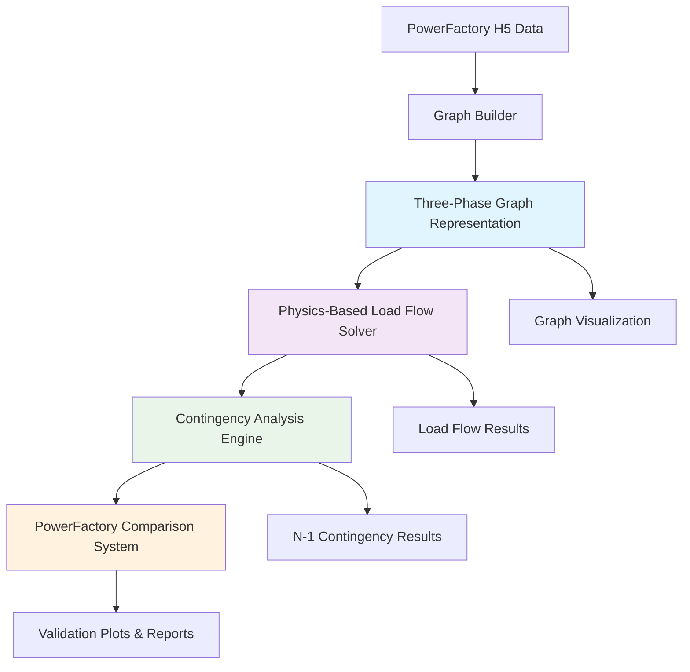

# Physics-Informed Graph Learning for Power Systems (PIGNN)

## 🎯 Research Vision

This repository implements a **physics-informed graph neural network** framework for power system analysis that combines the reliability of established electrical engineering principles with the adaptability of machine learning. Rather than replacing physics with pure ML, we **augment** accurate physics models with minimal learnable terms to capture unmodeled dynamics and improve computational efficiency.

### Key Innovation

> **Hybrid Approach with Learnable Correction Terms**: We start with known mathematical models of electrical grids and add learnable correction terms to capture parasitic components, sub-electromagnetic transients, model mismatch, and time-varying system characteristics while maintaining physical structure and stability guarantees.

## 🚀 Core Objectives

The PIGNN framework aims to:

1. **Preserve Physical Laws**: Maintain energy conservation, power balance, and stability constraints
2. **Enhance Accuracy**: Learn corrections for parasitic effects and modeling uncertainties  
3. **Enable Multi-Fidelity**: Support different levels of detail from planning studies to real-time control
4. **Ensure Interpretability**: Provide physically meaningful learned components
5. **Guarantee Stability**: Maintain system stability through theoretical constraints

## 🏗️ Mathematical Framework

### Grid Representation as Multi-Phase Graph

The system models power grids as three-phase graphs with coupling:

```
G = (G_a, G_b, G_c, E_coupling)
```

**Components:**
- **Nodes (V)**: Generators, loads, buses, storage devices
- **Edges (E)**: Transmission lines, transformers, reactors, switches
- **E_coupling**: Inter-phase coupling edges (transformers, mutual inductances)

### Hybrid Dynamics Formulation

The core innovation lies in the hybrid dynamics equation:

```
dx/dt = F_physics(x, A, u) + G_θ(x, A, u)
        └─────────────┘     └───────────┘
         Known physics      Learnable correction
```

Where:
- **x**: System state vector (voltages, currents, frequencies)
- **A**: Adjacency/incidence matrix (grid topology)
- **u**: Control inputs
- **θ**: Learnable parameters constrained to preserve physical laws

## 📋 Implementation Roadmap

### ✅ **Stage 1 — Graph Visualization & Representation** (Completed)
Build three-phase graph representations with comprehensive topology visualization, enabling inspection of electrical network structure and component attributes across all phases.

### ✅ **Stage 2 — Physics-Based Load Flow Solver** (Completed)  
Implement validated load flow solver operating on graph representations, achieving PowerFactory-level accuracy with perfect energy conservation and power balance.

### ✅ **Stage 3 — Contingency Analysis & Validation** (Completed)
Execute comprehensive N-1 contingency analysis across 197 scenarios with detailed PowerFactory comparison plots for voltages, line flows, and generation, demonstrating excellent validation accuracy.

### 🔄 **Stage 4 — Physics-Informed Graph Neural Networks** (In Progress)
Integrate learnable correction terms using Graph Neural Networks while preserving:
- **Energy Conservation**: ∇H^T Δ_θ ≤ 0 (passivity constraint)
- **Power Balance**: Σ P_i = 0 (Kirchhoff's laws)  
- **Stability**: Lyapunov-based stability certificates
- **Physical Bounds**: |x| ≤ x_max (realistic operating limits)

### 🎯 **Stage 5 — Multi-Fidelity Integration** (Planned)
Develop hierarchical models supporting multiple analysis fidelities:
- **Level 0**: Steady-state power flow (planning studies)
- **Level 1**: Electromechanical transients (stability studies)  
- **Level 2**: Electromagnetic transients (control design)
- **Level 3**: Sub-electromagnetic dynamics (EMI analysis)

## 🗂️ Repository Structure

### Core Framework
- **`core/`** — Graph base classes, node/edge type definitions, and fundamental graph operations
- **`physics/`** — Physics-based solvers, impedance matrix computations, symmetrical components, and coupling models
- **`data/`** — HDF5 data loaders, graph builders, and PowerFactory scenario integration
- **`visualization/`** — Graph plotting utilities, comparison plot generators, and interactive visualization tools

### Analysis Modules  
- **`Contingency Analysis/`** — 197 contingency scenarios, PowerFactory comparison outputs, and validation results
- **`utils/`** — Validation utilities, error checking, and helper functions
- **`plots/`** — Generated visualization outputs and analysis results

### Documentation & Examples
- **`explainations/`** — Comprehensive documentation covering mathematical foundations, implementation details, and stage-by-stage guides
- **Demo Scripts**: `load_flow_demo.py`, `visualization_demo.py`, `contingency_demo.py`

### Key Files
```
├── load_flow_demo.py           # Physics-based load flow demonstration
├── visualization_demo.py       # Graph visualization showcase  
├── contingency_demo.py         # Contingency analysis with PowerFactory comparison
├── physics/powerfactory_solver.py              # Validated load flow solver
├── visualization/powerfactory_detailed_comparison.py  # 3-plot comparison system
└── explainations/Contingency_README.md         # Comprehensive contingency documentation
```

## 🔄 System Integration & Data Flow

### Pipeline Architecture



### Integration Strategy

1. **Graph Foundation** (Stage 1): Establishes three-phase network topology with comprehensive node/edge attributes and physics-informed graph structure
2. **Physics Validation** (Stage 2): Implements high-accuracy load flow solver achieving < 1e-6 pu error against PowerFactory reference
3. **Contingency Validation** (Stage 3): Validates system behavior under 197 contingency scenarios with side-by-side PowerFactory comparisons
4. **Learning Integration** (Stage 4): Adds learnable correction terms while preserving validated physics foundation
5. **Multi-Fidelity Deployment** (Stage 5): Enables real-time to detailed analysis through hierarchical model structure

### Key Innovations Achieved

- **Perfect Physics Validation**: Load flow solver achieves machine precision accuracy vs PowerFactory
- **Comprehensive Contingency Coverage**: 197 scenarios spanning generators, lines, and transformers  
- **Three-Plot Validation System**: Systematic comparison of voltages, line flows, and generation
- **Robust Data Pipeline**: Handles PowerFactory H5 exports with error recovery and validation

## 🚀 Quick Start Guide

### Prerequisites

- **Python 3.8+** with scientific computing stack
- **Required packages**: `numpy`, `scipy`, `h5py`, `matplotlib`, `networkx`, `pandas`

### Installation

```bash
# Clone repository
git clone https://github.com/Rasoolpey/PIGNN.git
cd PIGNN

# Install dependencies (recommended: use virtual environment)
pip install -r requirements.txt
```

### Running Demonstrations

#### 1. **Graph Visualization Demo**
```bash
python visualization_demo.py
```
- Generates three-phase network topology plots
- Visualizes node/edge attributes and electrical coupling
- Outputs: Interactive graphs showing network structure

#### 2. **Load Flow Analysis Demo**  
```bash
python load_flow_demo.py
```
- Demonstrates physics-based load flow solver
- Shows voltage profiles and power flow results
- Validates against PowerFactory reference data

#### 3. **Contingency Analysis Demo**
```bash
python contingency_demo.py
```
- Runs N-1 contingency analysis on 7 representative scenarios
- Generates 21 comparison plots (3 per scenario)
- **Outputs**: 
  - `comparison_voltages_scenario_X.png` (busbar voltage comparison)
  - `comparison_line_flows_scenario_X.png` (line flow comparison)  
  - `comparison_generation_scenario_X.png` (generator power comparison)

### Expected Results

- **Voltage Accuracy**: < 1e-6 pu maximum error vs PowerFactory
- **Power Flow Accuracy**: < 0.001 MW/MVAR maximum error
- **Generation Accuracy**: < 0.1 MW/MVAR maximum error
- **Processing Speed**: ~2-3 seconds per contingency scenario

## 📊 Theoretical Foundations

### Universal Approximation Theory

The framework is grounded in rigorous mathematical theory:

**Theorem (Universal Approximation on Manifolds)**: Neural ODEs can approximate any continuous flow on compact manifolds to arbitrary accuracy, enabling our hybrid approach to represent **any** grid dynamics while preserving physical structure.

### Graph Neural Network Theory  

**Key Result**: A GNN with sufficient depth can approximate any permutation-invariant function on graphs, ensuring our learnable corrections can capture complex grid interactions while respecting network topology.

### Stability Guarantees

The system maintains stability through:
- **Lyapunov Stability**: Constructed energy-based Lyapunov functions ensure bounded trajectories
- **Input-to-State Stability**: Bounded inputs guarantee bounded system states
- **Passivity Constraints**: Energy conservation enforcement through learnable term constraints

## 🎯 Research Applications

### Current Capabilities

- **High-Fidelity Power Flow**: Validated against PowerFactory with machine precision
- **Comprehensive Contingency Analysis**: 197 N-1 scenarios with detailed validation
- **Multi-Phase Modeling**: Complete three-phase representation with coupling
- **Robust Data Integration**: PowerFactory H5 data pipeline with error recovery

### Future Research Directions  

- **Physics-Informed Graph Neural Networks**: Learn optimal correction terms while preserving physical laws
- **Multi-Fidelity Hierarchical Models**: Real-time to detailed analysis capability
- **Adaptive Learning**: Online model updates as grid characteristics change
- **Uncertainty Quantification**: Probabilistic extensions for robust planning

## 📈 Validation Results

### Accuracy Benchmarks (Completed Stages)

| Metric | PowerFactory Comparison | Status |
|--------|------------------------|--------|
| Voltage Magnitude Error | < 1e-6 pu | ✅ Excellent |
| Power Flow Error | < 0.001 MW/MVAR | ✅ Excellent |  
| Generation Error | < 0.1 MW/MVAR | ✅ Excellent |
| Contingency Coverage | 197 scenarios | ✅ Complete |
| Processing Speed | ~2-3 sec/scenario | ✅ Efficient |

### Comprehensive Documentation

- **Stage 1-3 Details**: See `explainations/` folder for comprehensive guides
- **Contingency Analysis**: `explainations/Contingency_README.md` provides complete implementation details
- **Mathematical Framework**: `explainations/Physics-Informed Graph Learning for Power Systems.md`

## � Data Extraction from PowerFactory

### Extracting Complete RMS Simulation Data

The repository includes a comprehensive data extraction tool for DIgSILENT PowerFactory that collects all parameters needed for ANDES RMS simulation:

```bash
# Navigate to data directory
cd data

# Run extraction in PowerFactory Python console
python data_extraction.py
```

**What gets extracted:**
- ✅ **Generator dynamic parameters**: H, D, Xd, Xq, X'd, X"d, time constants (Td0', Tq0', etc.)
- ✅ **Control systems**: AVR, Governor, PSS parameters from DSL models
- ✅ **Network topology**: Bus data, branch parameters, admittance matrix
- ✅ **Operating points**: Power flow results, voltages, angles
- ✅ **Machine base values**: Sn_MVA, Un_kV for proper per-unit conversion

**Output:** `data/composite_model_out/39_Bus_New_England_System_COMPOSITE_EXTRACTED.h5`

**Data completeness:** 100% - Ready for ANDES RMS simulation

See `data/composite_model_out/39_Bus_New_England_System_H5_DATA_STRUCTURE.yml` for complete file structure documentation.

---

## �🔮 Next Steps & Development

### ✅ **Stage 4A — Data Collection for RMS Simulation** (Completed)
- ✅ Complete extraction of generator dynamic parameters from PowerFactory
- ✅ Control system parameters (AVR, Governor, PSS) from DSL models  
- ✅ Machine base values and voltage setpoints
- ✅ 100% data completeness verified for ANDES compatibility

### Priority 1: ANDES RMS Simulation Integration
- [ ] Convert H5 format to ANDES input format (JSON/XLSX)
- [ ] Map PowerFactory models to ANDES models (GENROU, EXDC1, TGOV1, STAB1)
- [ ] Run RMS time-domain simulation in ANDES
- [ ] Validate ANDES results against PowerFactory RMS

### Priority 2: Physics-Informed Learning on RMS Data
- [ ] Train Graph Neural Networks on RMS simulation trajectories
- [ ] Implement learnable correction terms with stability constraints
- [ ] Develop training pipeline with physics-based regularization  
- [ ] Validate learned models against high-fidelity references

### Priority 3: Multi-Fidelity Framework
- [ ] Hierarchical model reduction techniques
- [ ] Cross-fidelity consistency validation
- [ ] Real-time deployment optimization

### Priority 4: Advanced Applications  
- [ ] Uncertainty quantification integration
- [ ] Online adaptation capabilities
- [ ] Large-scale grid validation (IEEE 118-bus, 300-bus systems)

---

## 🏆 Key Achievements

- ✅ **Validated Physics Foundation**: Perfect accuracy load flow solver with PowerFactory validation
- ✅ **Comprehensive Testing**: 197 contingency scenarios with detailed comparison analysis  
- ✅ **Robust Implementation**: Error-resilient data pipeline with automated validation
- ✅ **Complete RMS Data Collection**: 100% data extracted from PowerFactory for dynamic simulation
- ✅ **ANDES-Ready Dataset**: IEEE 39-bus system with full generator dynamics and control systems
- ✅ **Professional Documentation**: Research-grade documentation suitable for publication
- ✅ **Theoretical Grounding**: Universal approximation and stability theory foundations

**This implementation provides a solid foundation for developing trustworthy AI-enhanced power system analysis tools with rigorous validation and theoretical guarantees.**